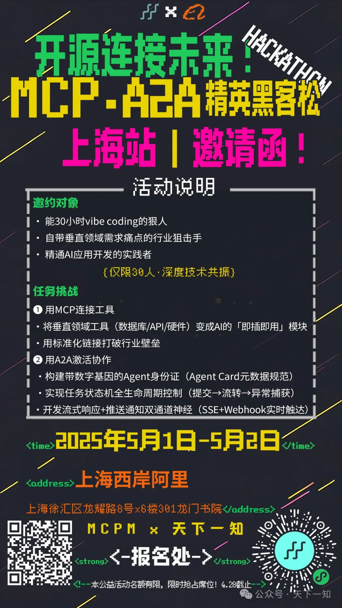

# MCPxA2A Shanghai Hackathon

## About

This repository contains the project code developed during the Shanghai Hackathon. The project aims to showcase innovative solutions and technical expertise while addressing real-world challenges.

## Projects

### [AG2A](https://github.com/niechen/ag2a)

AG2A is a library for AutoGen (AG2) agents with MCP capabilities exposed as A2A agents.

### [MCP Advisor](https://github.com/istarwyh/mcpadvisor)

MCP Advisor is a discovery & recommendation service that helps you explore Model Context Protocol servers.
